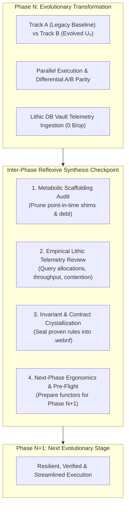
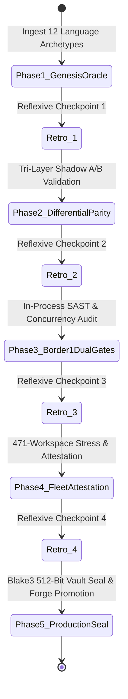

# Evolution-Scaffold Paradigm: Autonomous Reflexive Metamorphosis Engine

> **Authoritative Specification & Governance Protocol for Fleet-Wide Evolution**

---

## 1. Executive Vision: The Reflexive Evolution Engine

The **Evolution-Scaffold** is the platform-wide engine that autonomously migrates, optimizes, verifies, and modernizes software systems across the 471-workspace sovereign fleet. Rather than treating evolution as a linear script, the Evolution-Scaffold operates as a **Reflexive Category-Theoretic State Machine**.

---

## 2. The Inter-Phase Reflexive Synthesis Protocol

At the boundary of every phase transition ($P_N \to P_{N+1}$), the agent and engine MUST execute the **4-Question Reflexive Synthesis**:

### Question 1: Point-in-Time Scaffolding Audit (Metabolic Pruning)
* **Objective:** Identify and eliminate ephemeral scaffolding before it becomes legacy technical debt.
* **Audit Prompt:** *“Did Phase $N$ introduce any temporary shims, ad-hoc AST mutators, or mock helpers that are now superseded by our permanent compiler ($U_0$, Nautilus, Macro-IR)?”*
* **Rule:** Ephemeral helpers (like legacy `goenhancer`) must be metabolically pruned the moment their underlying problem is solved generically.

### Question 2: Empirical Lithic Telemetry Review
* **Objective:** Query the zero-copy Lithic DB vault for quantitative performance and safety metrics.
* **Audit Prompt:** *“What do the empirical throughput ($\text{GB/s}$), heap allocation ($\text{B/op}$), and lock contention telemetry reveal about bottlenecks?”*
* **Target:** Enforce $0\text{ B/op}$ memory allocations and $\ge 2.5\times$ speedup over baseline.

### Question 3: Invariant & Contract Crystallization
* **Objective:** Prevent regression by codifying proven properties into declarative contracts.
* **Audit Prompt:** *“What behavioral invariants did we prove in Phase $N$ that can now be sealed into declarative `.webnf` contracts?”*
* **Output:** Sealed `.concurrency.webnf`, `.workspace-dna.webnf`, and Blake3 512-bit attestation certificates.

### Question 4: Next-Phase Ergonomics & Resilience
* **Objective:** Lower cognitive load and computational friction for Phase $N+1$.
* **Audit Prompt:** *“What toolchain upgrades, macro opcodes, or pre-allocated arenas would make Phase $N+1$ easier, faster, and fail-safe?”*

---

## 3. Five Core Platform Invariants Codified from Recent Milestones

| Invariant Pillar | Core Principle | Technical Implementation |
|---|---|---|
| **I. Zero Raw Log Files** | Never emit unstructured `.log` text files. All metrics stream into embedded Lithic DB vaults. | `LithicFleetStore` + lock-free `FanInCollector` (`00flow/forge/*.lithic`). |
| **II. Border 1 Dual Gates** | In-process security SAST and concurrency LOG-cycle deadlock checks run in parallel at Border 1. | `macroir.ExecuteBorder1DualGates()` (`nontrivial` + `applyconcurrency`). |
| **III. Zero-Allocation Flat Memory** | Use Structure-of-Arrays and thread-local byte arenas to eliminate GC pressure completely. | `FlatASTSoA` + `ADPHByteArena` ($0\text{ B/op}$). |
| **IV. Dynamic DAG Boundaries** | Workspaces are discovered dynamically via `go.work` and `.workspace-dna.webnf`. | Permanent retirement of legacy `.gitroot` and static paths. |
| **V. Streaming Multi-Repo Preservation** | Sync, commit, and push changes across all 471 workspaces in a single streaming pass. | `C:\aCogSpaceSeed\00flow\forge\97000-internal-toolchains\vkey.exe construct preserve -silo <silo>`. |

---

## 4. Phase Execution Lifecycle Matrix

---

## 5. Summary Checklist for Evolutionary Agents

When orchestrating or executing an Evolution-Scaffold task:
- [ ] **Ingest** polyglot source code into $U_0$ `FlatASTSoA` ($0\text{ B/op}$).
- [ ] **Stream** telemetry directly into `.lithic` database via `FanInCollector`.
- [ ] **Audit** at Border 1 using parallel dual gates (`nontrivial` security + `applyconcurrency` deadlock/false-sharing).
- [ ] **Execute** the 4-Question Reflexive Synthesis at every phase boundary.
- [ ] **Prune** ephemeral point-in-time shims immediately upon phase completion.
- [ ] **Preserve** multi-repo state using sovereign `vkey construct preserve`.
