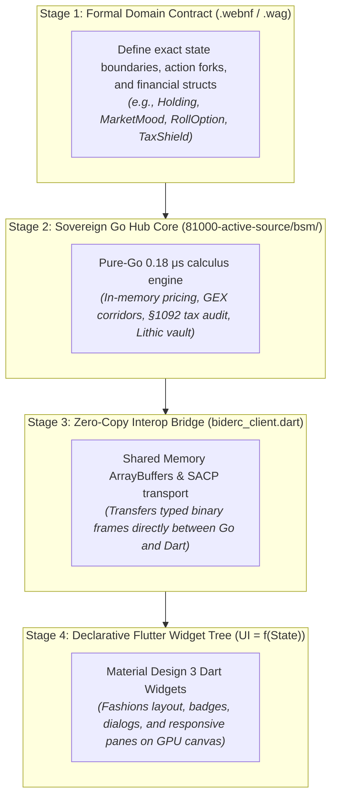

# Flutter + Go Hub Declarative Pipeline & Zero-CSS Governance (ADR-024)

> [!IMPORTANT]
> **TOP 4 ZERO-TOLERANCE RULES FOR FLUTTER & GO HUB UI WORKSPACES:**
> 1. **NO RAW CSS/HTML EDITING:** Agents must NEVER edit `.css` or `.html` files in `web_release/` or deployment directories. All user interfaces must be authored strictly as declarative Dart widgets ($\text{UI} = f(\text{State})$) in `81000-active-source/ui/`.
> 2. **GO HUB IS THE SOLE CALCULUS AUTHORITY:** All financial derivatives calculus (Black-Scholes-Merton, Greeks, GEX support/resistance walls, IRS § 1092 Qualified Covered Call rules, Form 8949 tax schedules) MUST execute in pure Go (compiled to Wasm-GC or native binary). Flutter is exclusively the reactive presentation and input layer.
> 3. **ZERO-COPY SACP / MEMORY TRANSPORT:** Data exchange between the Go Hub and Flutter Web MUST flow through typed `ArrayBuffer` pointers using modern `dart:js_interop` and `package:web`, strictly bypassing legacy HTTP REST polling, JSON serialization overhead, and deprecated `dart:html`/`dart:js` imports.
> 4. **CANONICAL DART LOCATION:** Active Flutter source code lives under `81000-active-source/ui/` (`main.dart`, `m3_theme_palette.dart`, `l10n.dart`, `biderc_client.dart`).

---

## 1. The 4-Stage Declarative Lifecycle

Every UI and algorithmic change in full-stack Flutter + Go workspaces MUST follow the 4-stage lifecycle:



---

## 2. Declarative Flutter UI Architecture ($\text{UI} = f(\text{State})$)

In Flutter, the screen is never manually manipulated. Widgets are constructed declaratively from the state stream emitted by the Go Hub:

### A. State Model Binding
```dart
// Pure Dart State Model emitted from Go Hub
class ShareholderState {
  final List<StockHolding> holdings;
  final MarketMood currentMood;
  final UserIntent currentIntent; // Owned, Actions, Puts
  final int activeShares;
  
  const ShareholderState({
    required this.holdings,
    required this.currentMood,
    required this.currentIntent,
    required this.activeShares,
  });
}
```

### B. Declarative View Switching
```dart
@override
Widget build(BuildContext context) {
  return switch (state.currentIntent) {
    UserIntent.harvestOwned => const OwnedHoldingsWorkflow(),
    UserIntent.reviewActions => const ActionRadarWorkflow(),
    UserIntent.discountPuts => const DiscountPutsWorkflow(),
  };
}
```

---

## 3. Material Design 3 (M3) Native Styling Rules (No CSS)

1. **Theme Tokens:** All colors, surface elevations, and tonal palettes are defined in `m3_theme_palette.dart` using `ColorScheme.fromSeed(...)` and `ThemeData(useMaterial3: true)`.
2. **Dynamic Mood Badges:** Visual states (e.g. `🔥 Surge Demand`, `⚡ High Demand`, `🟢 Calm & Steady`, `❄️ Dormant`) are styled using native Flutter `Container`, `BoxDecoration`, `Badge`, and `InkWell` widgets.
3. **Responsive Grids:** Use `LayoutBuilder` and `MediaQuery.sizeOf(context)` to conditionally switch between vertical mobile stacks and horizontal panoramic desktop grids (e.g., for Chinese / full-screen financial workstations).
4. **Interactive Modals:** Implement modals as native `showDialog<T>` or `showModalBottomSheet<T>` widgets rather than DOM overlays.

---

## 4. Compilation & Deployment Protocol

* **Compilation:** Run workspace builds using the Sovereign Realize Builder:
  ```pwsh
  C:\aCogSpaceSeed\00flow\forge\96000-internal-executables\realize.exe -workspace <workspace_name>
  ```
* **Web Target:** Deploy output artifacts to `/96000-internal-executables/web_release/<workspace>_flutter_web` via automated compiler steps, never through manual HTML/CSS file editing.
