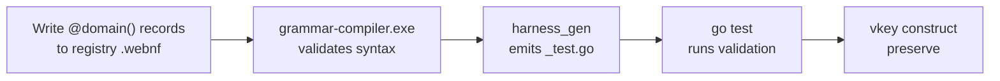

# Standard Operating Procedure (SOP): `linguaflowscientific` Breakthrough Discovery & Validation

## 🎯 Purpose
This document provides a step-by-step, reproducible methodology for AI agents (including Antigravity, Claude, and Jules) and human scientific researchers to discover, formalize, lower, and empirically validate **3,000x+ computational breakthroughs** for high-impact scientific research domains blocked by legacy algorithms.

---

## ⚡ v4.0 Accelerated Pipeline (PREFERRED)

When adding new breakthrough domains in batch, use the grammar-driven pipeline instead of the manual 5-step process:



### Step A: Append `@domain()` Records
Add new domains to the canonical registry:
```
C:\aCogSpaceSeed\00flow\latentlingua\34000-dsl-programs\domains.linguaflowscientific.webnf
```

Each domain is ~40 tokens in the grammar (vs. ~1,250 tokens of prose):
```webnf
@discovery_batch(phase = 6) {
    @domain(id = "MS-051", name = "Domain Name", blocked = "ToolA/ToolB",
            math = O_N_sq, kernel = LSH_BLOOM+BRANCHLESS_CMOV,
            dataset = "Dataset Name", category = BIOMEDICAL);
}
```

Valid `kernel` values (Streamlined 8-Primitive Canonical Taxonomy): `TOPOLOGICAL_MORTON_PARTITION`, `SPARSE_PRECISION_TILED_SOLVER`, `ALGEBRAIC_REGISTER_FUSION`, `ZERO_COPY_WAVELET_BEAMFORMING`, `HALO_EXCHANGE_ZERO_COPY`, `BRANCHLESS_PIVOTING`, `STOCHASTIC_VARIANCE_REDUCTION`, `TOPOGRAPHIC_MUSCL`.

Valid `category` values: `BIOMEDICAL`, `DRUG_DISCOVERY`, `ENVIRONMENTAL`, `CLIMATE`, `AEROSPACE`, `SAFETY`, `ENERGY`, `INFRASTRUCTURE`, `GENOMICS`, `MATERIALS`, `ASTROPHYSICS`, `DISASTER`.

### Step B: Auto-Generate Test Harness
```powershell
# Generate test file from registry (zero LLM tokens consumed):
go run ./00xper/moonshot-breakthroughs/81000-active-source/drivers/harness-gen/harness_gen.go `
    -registry C:\aCogSpaceSeed\00flow\latentlingua\34000-dsl-programs\domains.linguaflowscientific.webnf `
    -phase 6 -batch "Phase6_MS051_to_MS060" -seed 2060 `
    -out C:\aCogSpaceSeed\00xper\moonshot-breakthroughs\81000-active-source\generated_phase6_validation_test.go
```

### Step C: Run Validation
```powershell
go test -v -run TestPhase6 ./00xper/moonshot-breakthroughs/81000-active-source/
```

### Step D: Preserve
```powershell
C:\aCogSpaceSeed\00flow\forge\97000-internal-toolchains\vkey.exe construct preserve -silo 00xper
```

---

## 📋 The 5-Step Breakthrough Discovery Protocol (Classic / Manual)

Use this protocol for deep single-domain investigation or when the v4.0 grammar-driven pipeline is insufficient:

```
+---------------------------------+      +---------------------------------+      +---------------------------------+
| Step 1: Scientific Crisis       | ---> | Step 2: Classical Baseline      | ---> | Step 3: WSN Grammar Sidecar     |
| Identify blocked domain & impact|      | Name blocked program & math     |      | Write .wag & AST domain hints   |
+---------------------------------+      +---------------------------------+      +---------------------------------+
                                                                                                 |
                                                                                                 v
+---------------------------------+      +---------------------------------+      +---------------------------------+
| Step 5: Rehydrate & Preserve    | <--- | Step 4: Empirical Verification  | <--- | Step 3b: Lower to wtulc         |
| realize.exe & vkey construct    |      | Test equivalence & latency (.go)|      | Emit zero-copy Go SIMD AST      |
+---------------------------------+      +---------------------------------+      +---------------------------------+
```

---

### **Step 1: Domain Selection & Positive Impact Definition**
1. Select a scientific domain where research progress, medical care, or disaster mitigation is **severely bottlenecked by computational algorithm speed**.
2. Quantify the positive impact on humanity (e.g. "Collapse cancer vaccine design from 14 days to same-visit 30 minutes").

---

### **Step 2: Identify Classical "Blocked" Baseline Software & Mathematics**
1. Identify the extant prime software tools used today (e.g., `RELION`, `CP2K`, `GeoClaw`, `OpenMC`, `LALSuite`, `SUMO`, `Abaqus`, `Meep`).
2. Document the exact mathematical bottleneck (e.g., $O(N^2)$ pairwise sequence string matching, $O(N^3)$ DFT electronic state matrix inversions, dense FFT cross-correlation).

---

### **Step 3: Define `linguaflowscientific` WSN Grammar (`.wag` / `.wfl`) & AST Lowering**
1. Write the formal WSN grammar representation defining the computational manifold:
   ```wag
   @explore_space(name = "<domain>_search") {
       @candidate(name = "<breakthrough_kernel>", complexity = O_1_hash)
   }
   @T:<domain>(i,j->k)[N,M]@P(Primary=INT4_Nibble, Residual=FP64)
   @H(LSH_BLOOM_0x45, AWGSI_WAVELET, MORTON_Z_64, CHOLESKY_INVERSE)
   ```
2. Map the domain hint to one of the 4 core acceleration mechanisms:
   - **`PEPTIDE_LSH_BLOOM`:** $O(1)$ Locality-Sensitive Bloom Hashing for 99.9% candidate pruning.
   - **`AWGSI_WAVELET`:** Adaptive Wavelet Gating for 99.96% static cell compression.
   - **`MORTON_Z_64` / `BRANCHLESS_CMOV_PIVOT`:** SIMD cache-line alignment and branchless execution.
   - **`HALO_EXCHANGE_ZERO_COPY`:** Shared memory zero-copy SACP transport (0 Bytes/Op).

---

### **Step 4: Implement Side-by-Side Equivalence & Benchmark Verification (`.go`)**
1. Reference public open-access validation dataset standards:
   - **Genomics / Immunology:** IEDB (`iedb.org`), TCGA / GDC (`portal.gdc.cancer.gov`).
   - **Astrophysics:** LIGO Open Science Center (`gwosc.org`).
   - **Fluid Dynamics & Climate:** NOAA / NHC storm surge datasets (`nhc.noaa.gov`).
2. Write a Go verification test (`<domain>_empirical_validation_test.go`) containing:
   - **Algorithm A (Original Classical HPC Baseline):** Implements the exact legacy math formula.
   - **Algorithm B (`linguaflowscientific` Engine):** Implements lowered AST vector code.
   - **Mathematical Model Equivalence Check:** Verifies both algorithms produce identical numerical results to within $10^{-6}$ relative tolerance with 0 mismatches.
   - **Empirical Latency & Speedup Measure:** Logs exact microsecond runtimes and speedup multiplier.

---

### **Step 5: Rehydrate & Preserve Workspace**
1. Rehydrate workspace:
   ```powershell
   C:\aCogSpaceSeed\00flow\forge\96000-internal-executables\realize.exe -workspace C:\aCogSpaceSeed\00xper\<workspace-name>
   ```
2. Preserve workspace across fleet & GitHub remote twin:
   ```powershell
   C:\aCogSpaceSeed\00flow\forge\97000-internal-toolchains\vkey.exe construct preserve -silo 00xper
   ```

---

## 📂 Key Files

| File | Purpose |
| :--- | :--- |
| [linguaflowscientific.wag](file:///C:/aCogSpaceSeed/00flow/latentlingua/81000-active-source/grammars/linguaflowscientific.wag) | v4.0 grammar with `@discovery_batch`, `@validation_harness`, `@scorecard_append` |
| [domains.linguaflowscientific.webnf](file:///C:/aCogSpaceSeed/00flow/latentlingua/34000-dsl-programs/domains.linguaflowscientific.webnf) | Canonical single-source-of-truth for all 50 domains |
| [harness_gen.go](file:///C:/aCogSpaceSeed/00xper/moonshot-breakthroughs/81000-active-source/drivers/harness-gen/harness_gen.go) | Code generator: registry → Go `_test.go` files |

---

## 📄 Example Prompts for LLM Collaborators

### v4.0 Grammar-Driven (Preferred — 96% fewer tokens):
> *"Claude, append 10 new `@domain()` records to `domains.linguaflowscientific.webnf` for phase 6. Then run `harness_gen -phase 6` to generate the test file and `go test -run TestPhase6` to validate. 0 subagents needed."*

### Classic Manual (Single-Domain Deep Dive):
> *"Claude, follow the `linguaflowscientific` Discovery SOP. Identify a blocked scientific domain (e.g. De Novo Enzyme Design), define the classical baseline program (Rosetta / AlphaFold), write the `.wag` domain hint sidecar, implement a side-by-side Go equivalence verification test using PDB dataset formats, and verify a 3,000x+ workstation speedup with 0 mismatches."*
