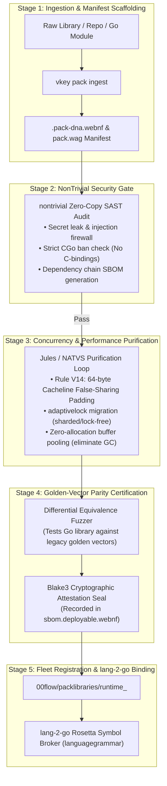

# Sovereign Pack Library Ingestion & Verification Process

> **Taxonomy:** `.agents/guidelines/pack_library_ingestion_process.md`  
> **Authority:** Sovereign Platform Architecture & Governance  
> **Status:** ACTIVE & ENFORCED

---

## 1. Overview

A **Pack Library** is a domain runtime substrate (e.g. `runtime_mumps`, `runtime_sas`, `runtime_ada`, `runtime_q_kdb`, `runtime_rpg`) that provides the execution engines, mathematical procedures, and standard library emulations called by `lang-2-go` transpiled code.

To enable `lang-2-go` to reliably call both **Official (Tier 1 Sovereign)** and **Unofficial (Community / Third-Party)** runtime libraries, all packs must pass through the **5-Stage Sovereign Ingestion & Purification Pipeline**.

The formal manifest grammar (`grammar_pack_manifest.wag`) and symbol broker reside directly in **`00flow/languagegrammar`**.

---

## 2. The 5-Stage Ingestion Pipeline



---

## 3. Tier Classification

| Tier | Classification | Guarantees | Origin |
|---|---|---|---|
| **`TIER_1_SOVEREIGN`** | Official Core | 0 B/op allocations; $<10\text{ ns}$ execution; $100\%$ pure Go; formal Lean 4 invariants. | VelociKey / Fleet Authored |
| **`TIER_2_VERIFIED`** | Partner / Certified | $100\%$ golden vector equivalence; zero CGo; clean AST. | Certified Consultancies / System Integrators |
| **`TIER_3_COMMUNITY`** | Unofficial Staged | Functional emulation; undergoing automated Jules/NATVS purification. | Open-Source / Third-Party |

---

## 4. Formal Pack Manifest Grammar

Every Pack Library is defined using the **Pack Manifest Grammar** in `00flow/languagegrammar/grammar_pack_manifest.wag`:

```wag
pack_manifest {
    name: "runtime_mumps" ;
    target_language: "MUMPS_M" ;
    tier: TIER_1_SOVEREIGN ;
    version: "1.0.0" ;
    import_path: "sov.fleet/packlibraries/runtime_mumps/81000-active-source" ;

    symbols {
        export {
            name: "Piece" ;
            legacy_intrinsic: "$P" ;
            target_go_call: "mumpsruntime.Piece" ;
            alloc_free: true ;
            max_latency_ns: 10 ;
        }
        export {
            name: "GetGlobal" ;
            legacy_intrinsic: "^" ;
            target_go_call: "mumpsruntime.GetGlobal" ;
            alloc_free: true ;
            max_latency_ns: 25 ;
        }
    }

    golden_tests {
        fixture {
            name: "PieceExtraction" ;
            legacy_input: "$P(\"A^B^C\", \"^\", 2)" ;
            expected_output: "B" ;
        }
    }
}
```

---

## 5. `lang-2-go` Code Generation Integration

When `lang-2-go` translates legacy code, it queries the `languagegrammar.PackLibraryRegistry`:

```go
// Transpiler queries the Symbol Broker:
sym, importPath, found := registry.LookupSymbol(currentLanguage, legacyToken)
if found {
    // 1. Injects import if not present
    builder.AddImport(importPath)
    // 2. Emits verified Go substrate call
    builder.EmitCall(sym.TargetGoCall, args)
}
```
