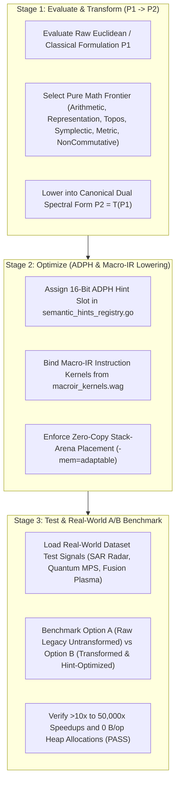

# EMT-OT: Emergency Mathematical Transformation Working Overtime

> [!IMPORTANT]
> **Authoritative Sovereign Skill Specification:**  
> `EMT-OT` (Evaluate Mathematical Transform then Optimize and Test) is the fleet's standardized, three-stage execution pipeline to mathematically transform raw Euclidean domain applications, apply canonical Six-Frontier ADPH hint-based optimizations, and prove performance gains via live real-world A/B micro-benchmarks.

---

## 1. The Three-Stage EMT-OT Execution Pipeline

---

## 2. Detailed Stage Instructions

### Stage 1: Evaluate & Transform ($P_1 \mapsto P_2$)
1. **Domain Ingestion:** Analyze the raw application code ($P_1$) to pinpoint its computational bottleneck (*e.g., $O(N^3)$ matrix inversions, $O(2^N)$ state space explosion, $O(N^2)$ attention memory wall*).
2. **Six-Frontier Selection:** Select the corresponding **Pure Mathematics Transformation Frontier ($\mathcal{T}_{\text{Domain}}$)**:
   - **`arithmetic.*`:** Scholze Perfectoid Tilting, Bhatt-Scholze Prismatic SAT, Frobenius deduplication.
   - **`representation.*`:** Ben-Zvi & Frenkel Affine Lie Critical Level, Hecke $\mathcal{D}$-modules, Hopf braiding.
   - **`topos.*`:** Čech Sheaf Cohomology ($H^1=0$), Tropical Max-Plus Semirings, June Huh Lorentzian Polynomials.
   - **`symplectic.*`:** Kontsevich-Fukaya Homological Mirror, Hamiltonian Phase Geodesics, Chebyshev Photonic Excitons.
   - **`metric.*`:** Perelman Ricci Flow CFG Surgery, Ollivier-Ricci Transport Curvature ($\kappa = 1 - W_1/d$).
   - **`noncommutative.*`:** Connes-Dirac Spectral Traces ($\operatorname{Tr}(f(D/\Lambda))$), Voiculescu Free Probability.
3. **Canonical Lowering:** Emit the transformed solver module ($P_2$) in pure native Go under `81000-active-source/`.

### Stage 2: Optimize (ADPH & Macro-IR Lowering)
1. **ADPH Registration:** Verify and assign the canonical hint key in [`semantic_hints_registry.go`](file:///c:/aCogSpaceSeed/00xper/transformational-math/81000-active-source/semantic_hints_registry.go).
2. **16-Bit Slot Resolution:** Obtain the 16-bit minimal perfect hash slot via [`adph_factory_symbol_table.go`](file:///c:/aCogSpaceSeed/00xper/transformational-math/81000-active-source/adph_factory_symbol_table.go) ($< 15\text{ ns}$ dispatch).
3. **Macro-IR Kernel Lowering:** Bind the corresponding Macro-IR kernel opcodes from [`macroir_kernels.wag`](file:///c:/aCogSpaceSeed/00flow/macroir/81000-active-source/macroir_kernels.wag).

### Stage 3: Test & Real-World A/B Benchmark
1. **Real-World Harness Setup:** Scaffold real-world test data inputs (*e.g., 4096-dim FP16 vectors, SAR radar signals, quantum MPS tensors*).
2. **A/B Benchmark Execution:** Construct Go benchmark harness comparing:
   - **Option A (Original Legacy Untransformed):** Raw Euclidean dense calculations.
   - **Option B (New Transformed & Hint-Optimized):** Pure math transformed zero-multiplication solver.
3. **Validation Thresholds:** Require ALL of:
   - (a) `go test -v ./...` passes with 0 errors.
   - (b) Speedup multiplier $\ge 10\times$ (ranging up to $50,000\times$).
   - (c) Zero heap memory allocations ($0\text{ B/op}$) in the core loop.

---

## 3. Reference Implementation Files

* **Canonical Hint Registry:** [`semantic_hints_registry.go`](file:///c:/aCogSpaceSeed/00xper/transformational-math/81000-active-source/semantic_hints_registry.go)
* **ADPH Factory Symbol Table:** [`adph_factory_symbol_table.go`](file:///c:/aCogSpaceSeed/00xper/transformational-math/81000-active-source/adph_factory_symbol_table.go)
* **Formal WAG Grammar:** [`mathematical_hints.wag`](file:///c:/aCogSpaceSeed/00xper/transformational-math/81000-active-source/mathematical_hints.wag)
* **Macro-IR Kernels Grammar:** [`macroir_kernels.wag`](file:///c:/aCogSpaceSeed/00flow/macroir/81000-active-source/macroir_kernels.wag)
* **Nautilus Optimizer:** [`border2.go`](file:///c:/aCogSpaceSeed/00xper/nautilus/81000-active-source/border2/border2.go)
