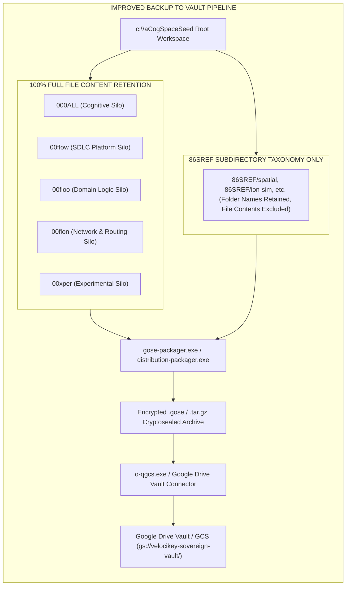

# Sovereign `backup-to-vault` Skill

## Overview

The **`backup-to-vault`** skill provides a zero-trust, off-GitHub backup mechanism that packages all workspace source code (`000ALL`, `00flow`, `00floo`, `00flon`, `00xper`) into encrypted `.gose` cryptoseal archives and uploads them to **Google Drive Vault** or **Google Cloud Storage (`gs://velocikey-sovereign-vault/`)**.

This ensures full code preservation completely independent of GitHub remotes.



---

## Silo Inclusion & Taxonomy Rules

1. **Active Silos (100% Full File Contents Retained):**
   - `000ALL` (Cognitive Silo — 100% of blueprints, proofs, and AREA indexes)
   - `00flow` (SDLC Platform Silo — 100% of compilers, tools, and executables)
   - `00floo` (Domain Logic Silo — 100% of domain services, billing, and logic)
   - `00flon` (Network & Routing Silo — 100% of SACP QUIC drivers and ingress)
   - `00xper` (Experimental Silo — 100% of active research workspaces)
2. **`86SREF` Subdirectory Taxonomy-Only Rule:**
   - **`86SREF` Subdirectories Retained:** Preserves folder taxonomy names down to subdirectory level (e.g. `86SREF/spatial/`, `86SREF/ion-sim/`, `86SREF/kinemat/`, `86SREF/ligand-screen/`, `86SREF/navier/`, `86SREF/rna/`, etc.).
   - **File Contents Excluded:** Excludes third-party clone file contents inside `86SREF` to eliminate redundancy and maintain zero storage bloat.

---

## Agent Usage Protocol

To back up all active code and 86SREF subdirectory taxonomy to Google Drive Vault outside of GitHub:

```bash
# Option A: Unified vkey master command
C:\aCogSpaceSeed\00flow\forge\97000-internal-toolchains\vkey.exe construct vault

# Option B: Direct gose-packager toolchain
C:\aCogSpaceSeed\00flow\forge\96000-internal-executables\gose-packager.exe -target "velocikey-vault" -ref-taxonomy-only "86SREF"
C:\aCogSpaceSeed\00flow\forge\96000-internal-executables\o-qgcs.exe -upload "velocikey-vault.gose" -bucket "gs://velocikey-sovereign-vault"
```
