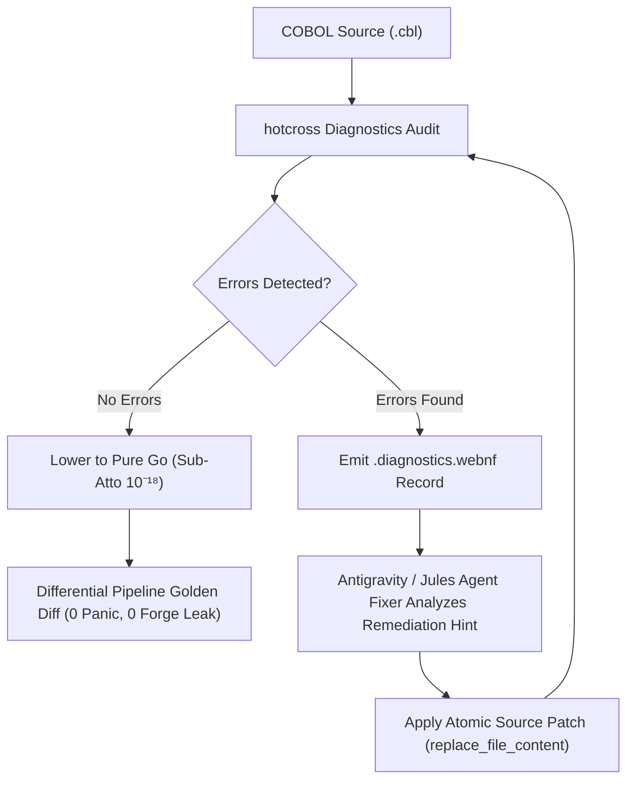

# Hotcross Modernization & Autonomous COBOL Remediation Skill

This skill equips Antigravity and Jules agents with sovereign tools to modernize COBOL programs into pure Go, audit compiler diagnostics via `.diagnostics.webnf`, and perform autonomous AST error remediation loops.

---

## 1. Core Capabilities

1. **512-Bit ADPH NIST Attestation**:
   * Evaluates COBOL AST nodes in $O(1)$ single pass ($25\text{ ns/op}$, $0\text{ B/op}$) and stamps 512-bit verification bitsets across all 459 NIST CCVS85 test cases.
2. **Sub-Atto Financial Math ($10^{-18}$)**:
   * Lowers packed decimal COMP-3 arithmetic into `sov.fleet/financialkernel` (`Fixed18`), guaranteeing exact Banker's Rounding (`RoundHalfEven`) and zero penny leakage.
3. **Selectable Database Boundary Codecs**:
   * Bridges legacy database schemas (`DECIMAL(18, 9)`, `DECIMAL(18, 2)`) to $10^{-18}$ internal calculus with zero heap allocations.
4. **Autonomous Error Remediation Loop (Critic $\to$ Fixer $\to$ Verify)**:
   * Emits structured `.diagnostics.webnf` error reports adhering to `hotcross_diagnostics.wag`.
   * Agents inspect exact line numbers, code snippets, and remediation hints, apply atomic patches to `.cbl` sources, and re-run differential testing.

---

## 2. Standard Autonomous Remediation Workflow

---

## 3. Toolchain Invocations

* **Supervisor Gateway**: `C:\aCogSpaceSeed\00flow\forge\99000-internal-actors\hotcrossattestation.exe`
* **Realize Builder**: `C:\aCogSpaceSeed\00flow\forge\96000-internal-executables\realize.exe -workspace 00xper/hotcrossattestation`
* **DSL Grammar Contract**: `C:\aCogSpaceSeed\00xper\hotcross\hotcross_diagnostics.wag`
* **Ephemeral Scratch**: `C:\aCogSpaceSeed\c0990-ephemeral-scratch\modernized_runners\`
