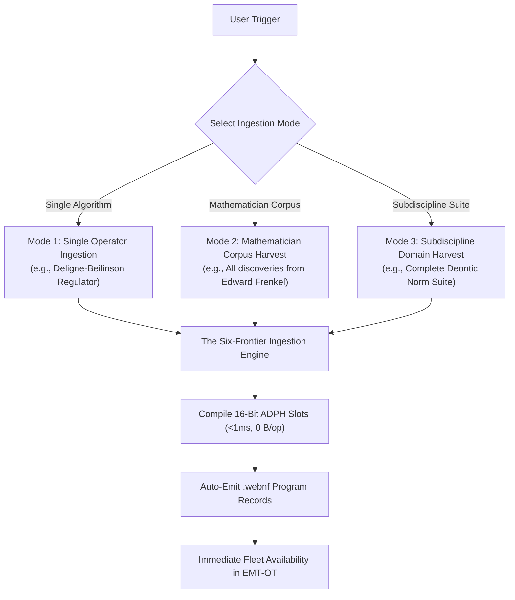

# Ingest-Math: Autonomous Mathematical Discovery & Corpus Ingestion Pipeline

> [!IMPORTANT]
> **Authoritative Sovereign Skill Specification:**  
> `ingest-math` provides the standardized autonomous protocol for ingesting newly discovered pure or applied mathematical algorithms, harvesting complete discovery corpora from a **specific mathematician** (e.g., *Peter Scholze, Edward Frenkel, Jacob Lurie, June Huh, Alain Connes*), or harvesting an entire **mathematical subdiscipline** (e.g., *Deontic Logic, Tropical Semirings, Prismatic Cohomology*) into the fleet's **Six Frontiers Taxonomy**.

---

## 1. Trigger Conditions

Activate this skill whenever the user says:
* *"Add this mathematical algorithm: [Name / Paper / Formula]"*
* *"Search for algorithms / discoveries from [Mathematician Name] to get a set"*
* *"Harvest all mathematical advances for [Domain / Area, e.g. Deontic, Tropical, Prismatic]"*
* *"Register a new mathematical hint for [Concept]"*

---

## 2. Supported Ingestion Modes

---

## 3. Detailed Workflows

### Mode 1: Single Algorithm Ingestion
1. **Frontier Mapping:** Classify into one of the Six Frontiers (`arithmetic`, `representation`, `topos`, `symplectic`, `metric`, `noncommutative`).
2. **Canonical Key Formatting:** Format as `<frontier>.<subdomain>.<operator_001>`.
3. **Engine Invocation:** Invoke `IngestMathematicalAdvance(spec)` in [`math_advance_ingestion_engine.go`](file:///c:/aCogSpaceSeed/00xper/transformational-math/81000-active-source/math_advance_ingestion_engine.go).
4. **Verification:** Run `go test` in `transformational-math` to verify zero collisions and sub-nanosecond lookups.

---

### Mode 2: Mathematician Corpus Harvest (`"Search discoveries from <Person>"`)
When asked to harvest a set of breakthroughs from a specific mathematician:
1. **Corpus Survey:** Identify the 3 to 15 landmark theorems, functors, and invariants attributed to that mathematician.
2. **Multi-Frontier Mapping:** Map each breakthrough to its exact Frontier:
   * *Example (Peter Scholze):*
     - `arithmetic.scholze.perfectoid_tilting_001` (Perfectoid Spaces)
     - `arithmetic.bhatt_scholze.prismatization_001` (Prismatic Cohomology)
     - `topos.clausen_scholze.condensed_pyknotic_001` (Condensed Mathematics)
     - `arithmetic.fargues_scholze.shtuka_geometrization_001` (Geometrization of Local Langlands)
   * *Example (Edward Frenkel):*
     - `representation.frenkel.critical_center_001` (Feigin-Frenkel Critical Level)
     - `representation.frenkel_ben_zvi.vertex_algebra_001` (Vertex Algebras on Curves)
     - `symplectic.kapustin_witten_frenkel.s_duality_001` (Electric-Magnetic S-Duality)
3. **Batch Ingestion:** Batch-register each record into [`semantic_hints_registry.go`](file:///c:/aCogSpaceSeed/00xper/transformational-math/81000-active-source/semantic_hints_registry.go).
4. **ADPH Re-Compilation:** Build minimal perfect hash tables for the entire harvested corpus simultaneously.

---

### Mode 3: Subdiscipline Domain Harvest (`"Harvest advances for <Area>"`)
When asked to harvest an entire mathematical field (e.g. *Deontic Logic*, *Tropical Geometry*, *Free Probability*):
1. **Exhaustive Domain Audit:** Map out the complete theoretical suite of operators and contracts in that subdiscipline.
   * *Example (Deontic Pure Mathematics):*
     - `deontic.norm.algebraic_closure_001` (I/O Detachment Monad)
     - `deontic.norm.bisimulation_duality_001` (Coalgebraic State Bisimulation)
     - `deontic.norm.quantale_capability_001` (Girard Linear Token Gate)
     - `deontic.norm.kanger_lindahl_001` (7-Partition Orthogonal Auth)
     - `deontic.norm.coboundary_deadlock_001` (Čech Cohomology $H^1 = 0$)
     - `deontic.norm.hypersequent_cut_001` (Hypersequent Analytic Proof)
     - `deontic.norm.dyadic_preorder_001` (Contrary-to-Duty Minimization)
     - `deontic.norm.invariant_trap_001` (Zero-Tolerance Invariant Trap)
2. **Batch Registration & Macro-IR Lowering:** Bind all operators directly to their corresponding Macro-IR opcodes in [`macroir_kernels.wag`](file:///c:/aCogSpaceSeed/00flow/macroir/81000-active-source/macroir_kernels.wag).
3. **Attestation Report:** Emit a consolidated domain report in `00000-knowledge-foundations/`.

---

## 4. Reference Implementation Files

* **Ingestion Engine:** [`math_advance_ingestion_engine.go`](file:///c:/aCogSpaceSeed/00xper/transformational-math/81000-active-source/math_advance_ingestion_engine.go)
* **Canonical Registry:** [`semantic_hints_registry.go`](file:///c:/aCogSpaceSeed/00xper/transformational-math/81000-active-source/semantic_hints_registry.go)
* **ADPH Factory:** [`adph_factory_symbol_table.go`](file:///c:/aCogSpaceSeed/00xper/transformational-math/81000-active-source/adph_factory_symbol_table.go)
* **Transformation Skill:** [`EMT-OT/SKILL.md`](file:///c:/aCogSpaceSeed/.agents/skills/EMT-OT/SKILL.md)
