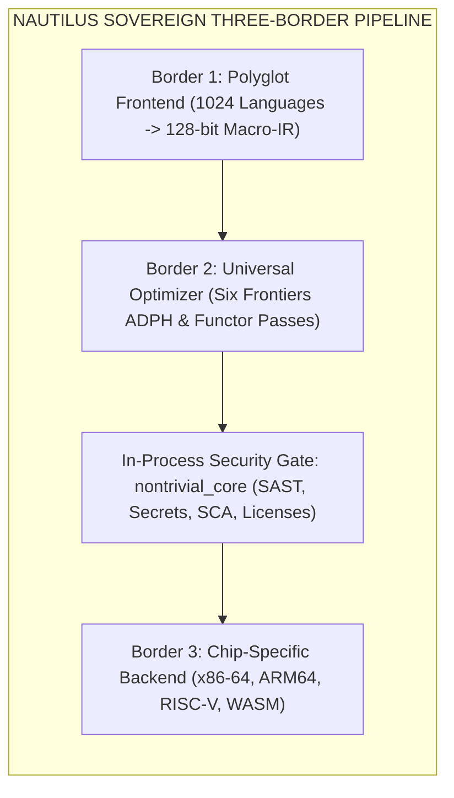

# Sovereign `nautilus-engine` Skill for Antigravity Agents

## Overview

The **`nautilus-engine`** skill equips Antigravity (IDE Agent), Jules (Engineering Agent), and Conductor (Orchestration Agent) with the **Nautilus Sovereign Three-Border Compiler Pipeline**.

Nautilus unifies 1024 polyglot language grammars into a 32 Macro-IR opcode universal representation, applies Six Frontiers ADPH mathematical optimizations, and lowers to target chip architectures with in-process `nontrivial_core` security gates.



---

## Capabilities Provided to Antigravity Agents

### 1. Border 1: Polyglot Ingestion & Universal Tokenization
- Ingests 1024 language grammars with zero-allocation Structure-of-Elements (SoE) representations.
- Emits universal 128-bit `MacroIRNode` sheaves with p-adic Frobenius symbol tagging and Fukaya Lagrangian phase-locking.

### 2. Border 2: Universal Six Frontiers Optimization
- Six Frontiers ADPH mathematical passes (branchless `CMOV` surgery, tropical polyhedral fan scheduling, Dirac spectral trace SSA verification).
- Sub-nanosecond deterministic functor lowering with zero heap allocations (`0 B/op`).

### 3. In-Process `nontrivial_core` Security Gates
- Pre-compilation and post-compilation security verification (42-language SAST tree-automata, secret shield, SCA reachability, viral license detection).

### 4. Border 3: Target Architecture Code Generation
- Zero-overhead lowering to native machine targets (x86-64 AVX-512, ARM64 NEON, RISC-V Vector, WebAssembly).

---

## Authoritative Execution Command

Run the authoritative Nautilus compiler binary:
```bash
C:\aCogSpaceSeed\00flow\forge\96000-internal-executables\nautilus.exe -workspace <path>
```
