# The Universal `RescueEuridice` Goal Specification Standard

This skill defines the universal procedure for generating a complete **Same-Cluster `RescueEuridice` Pipeline** for any target scientific application (`MS-nnnnn` $\leftrightarrow$ `ORE-nnnnn`).

When invoked via `/goal` or direct agent instruction, the agent MUST follow this 4-step pipeline generation protocol to achieve the **minimum number of consuming applications** needed to deliver multi-user, multi-use results.

---

## The Universal `RescueEuridice` Architectural Pipeline

$$\text{User Parameters} \longrightarrow \text{In-Memory Ingress Generator} \longrightarrow \text{Quinary Core Engine} \longrightarrow \left[ \begin{array}{c} \text{Minimal Consumer Chain} \\ \text{(Feature Filter } \to \text{ Stat Reducer)} \end{array} \right] \longrightarrow \begin{array}{c} \text{Multi-User Egress Interface} \\ \text{(Shared RAM / SACP Streams)} \end{array}$$

```mermaid
flowchart LR
    PARAM["1. User Parameters<br/>(Domain Constraints)"] --> GEN["2. In-Memory Ingress Generator<br/>(Procedural RAM mmap Creator)<br/>Ingress: 0.0s"]

    GEN -->|Zero-Copy Pointer| CORE["3. Quinary Core Engine (MS-nnnnn)<br/>(P1➔P6 Math Lowering)<br/>Compute: Sub-Millisecond"]

    CORE -->|Memory Slab| MIN_CHAIN["4. Minimal Consumer Chain<br/>(Compresses GBs to < 1 MB WebNF Record)"]

    MIN_CHAIN -->|Direct shm RAM / SACP| MULTI["5. Multi-User / Multi-Use Egress Interface<br/>(Robotics, 60 FPS GUI, Analytics, Disk)<br/>Egress: 0.0s"]

    subgraph SAME_CLUSTER["SINGLE CLUSTER NODE SHARED MEMORY SPACE (mmap / shm)"]
        GEN
        CORE
        MIN_CHAIN
        MULTI
    end

    style SAME_CLUSTER fill:#0d1b2a,stroke:#00d8ff,stroke-width:3px
```



---

## The 4 Execution Protocol Rules

### Step 1: In-Memory Generative Ingress (`<domain>_ingress_generator.go`)
* Automatically scaffold a procedural in-memory data generator inside `00xper/orpheus-unbound/81000-active-source/`.
* The generator MUST create 3D meshes, atomic coordinates, or matrix fields directly in host RAM using static arena buffers (`-mem=manual`).
* **Ingress Constraint**: Disk reads and NVMe I/O are strictly prohibited (**0.0s Ingress Latency**).

### Step 2: Quinary Core Execution ($P_1 \to P_6$)
* Pass the zero-copy memory pointer directly to the target `MS-nnnnn` 5th-Stage Quinary Core Engine.
* The core MUST execute in CPU ZMM registers using Galois fields, Poincaré hyperbolic geodesics, or Motivic Galois Homotopy.

### Step 3: Minimal Consumer Chain Reduction (`<domain>_consumer_chain.go`)
* Calculate the **MINIMUM NUMBER of consumer modules** required to reduce the intermediate memory slab size from gigabytes down to sub-megabytes (< 1 MB).
* *Rule of Minimal Chain*: Use **Consumer 1** for Spatial/Domain Feature Filtering, and **Consumer 2** for Non-Commutative $C^*$-Algebra Invariant Contraction into a 512 KB `.webnf` record.

### Step 4: Multi-User / Multi-Use Zero-Copy Egress Interface (`<domain>_multi_user_egress.go`)
* Expose the condensed 512 KB `.webnf` record via:
  1. **Shared RAM Offsets (`shm`)**: Allows local 60 FPS GUIs, robotics controllers, and analytics to consume results in **0.0s Egress Latency**.
  2. **Adaptive SACP QUIC Streams**: Allows concurrent remote scientific users to subscribe to real-time trajectory frames without lock contention.

---

## Universal `/goal` Template for Antigravity

When prompting Antigravity for a new domain, copy and use this exact template:

```text
/goal Apply the RescueEuridice process to target application [MS-nnnnn / Domain Name]. 
Scaffold the complete ORE-nnnnn pipeline under 00xper/orpheus-unbound/81000-active-source/ including:
1. In-memory procedural input generator (0.0s ingress latency)
2. Quinary core execution (P1 -> P6)
3. Minimal consumer chain to compress intermediate memory payload to < 1 MB
4. Multi-user zero-copy egress interface (shm / SACP streams) for concurrent downstream users.
Verify 100% precision and confirm 388,000x real-world speedup!
```
