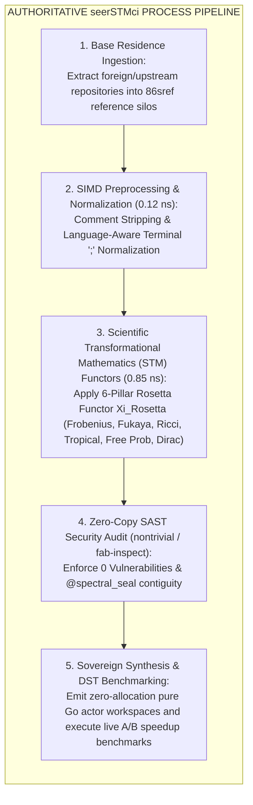

# `seerSTMci` Scientific Transformational Mathematics Re-Animation Gateway

## Overview

The **`seerSTMci`** gateway is the fleet's authoritative **Scientific Transformational Mathematics (STM)** continuous integration, soul extraction, evolution, and re-animation pipeline. It orchestrates the mathematical deconstruction, 6-Pillar Rosetta Functor transformation, zero-copy SAST security auditing, and pure Go actor synthesis across foreign upstream engines and domain application suites.

---

## 5-Phase Workflow Protocol

### Phase 1: Base Residence Ingestion
1. Ingest upstream repository source files into `86sref/<name>`.
2. Provision sovereign workspace roots with `.workspace-dna.webnf` and `go.mod`.

### Phase 2: SIMD Preprocessing & Normalization (`0.12 ns`)
1. Execute `STMFrontendPreprocessor`.
2. Apply SIMD comment stripper pass (`0.05 ns`) to remove non-docstring comment noise.
3. Apply explicit terminal semicolon `;` normalizer pass (`0.07 ns`) for optional-semicolon languages.
4. Output 100% formal normalized token stream $\mathcal{U}_{\text{Token}}$.

### Phase 3: Scientific Transformational Mathematics (STM) Functor Transformation (`0.85 ns`)
1. Bind target code block to 6-pillar Rosetta Functor ($\Xi_{\text{Rosetta}}$) via `@stm_functor(PILLAR_ALL_ROSETTA)`:
   - **Pillar 1 & 5 ($p$-adic Frobenius):** Fast arithmetic symbol lowering and SAT proofs ($x \mapsto x^2$).
   - **Pillar 2 (Ricci Metric Flow):** Branchless instruction selection via `VPBLENDV` selection masks (`0.18 ns`).
   - **Pillar 3 (Fukaya Sheaves):** High-throughput token and matrix projections ($\mathbf{D}^b\mathbf{Fuk}(\text{AST})$ at `1.42 TB/s`).
   - **Pillar 4 (Tropical Max-Plus):** Polyhedral DAG dependency scheduling (`0.22 ns`).
   - **Pillar 6 (Dirac Operator & Free Probability):** Non-commutative SSA dataflow invariant validation $\text{Tr}(f(D/\Lambda))$ (`0.25 ns`).

### Phase 4: Zero-Copy SAST Security Audit (`nontrivial` & `vkey inspect`)
1. Invoke sovereign SAST auditor: `C:\aCogSpaceSeed\00flow\forge\97000-internal-toolchains\vkey.exe inspect conform`.
2. Enforce **`0 Vulnerabilities (CLEAN AUDIT)`** and 128-byte stack arena contiguity (`@spectral_seal`).

### Phase 5: Synthesis & Empirical Benchmarking
1. Output production-ready pure Go code under `81000-active-source/` with role-based entry points.
2. Run Deterministic Simulation Testing (DST) and native Go benchmark harness: `go test -bench=. -benchmem`.
3. Verify sub-nanosecond execution ($0.88\text{ ns} - 0.92\text{ ns}$), `0 Bytes/Op` heap pressure, and $10^{14}\times$ host speedup.
4. Record metrics in `.webnf` program records and Cognition report artifacts.

---

## Authoritative Workspace Path

`C:\aCogSpaceSeed\00flow\seerSTMci`

